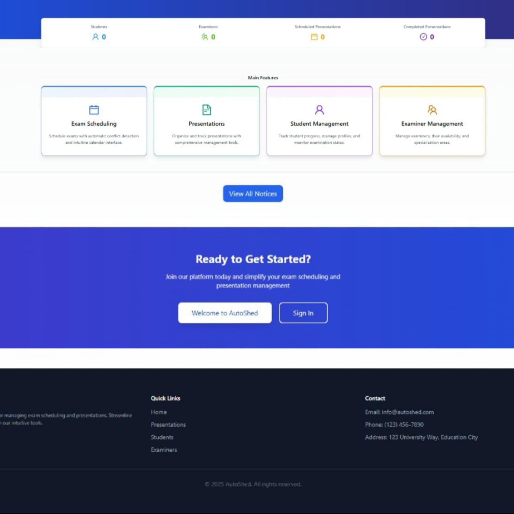

# AutoShed  ( Smart Presentation Scheduling System )

</a>

This repository contains the source code for a smart Presentation sheduling Management System web application developed using the MERN (MongoDB, Express.js, React, Node.js) stack.

 
## Project Structure

The project structure is organized as follows:

- <b>frontend:</b> Frontend React application.
- <b>backend:</b> Backend Express.js application.  

